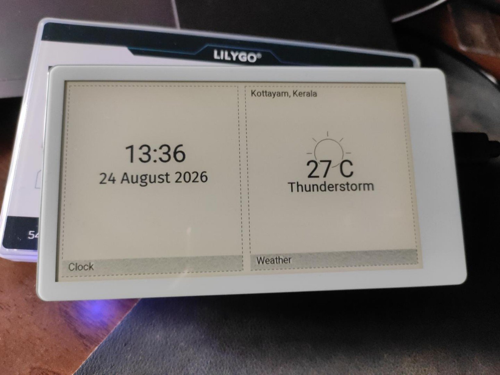

# ePaper Dashboard

A TRMNL-style split-panel dashboard sketch for the [LilyGo T5 4.7" ePaper S3](https://www.lilygo.cc/)
(ESP32-S3 + E-Ink display). Shows a **Clock** widget and a live **Weather** widget side by side,
in a clean monochrome layout with dashed widget borders and grey footer labels.



## Features

- **Accurate time** -- synced via NTP over WiFi at boot and every 6 hours after, with the onboard
  PCF8563 RTC chip as an offline fallback so it keeps ticking correctly between syncs.
- **Live weather** -- fetched from [Open-Meteo](https://open-meteo.com) (free, no API key) for a
  configurable location, refreshed every 30 minutes.
- **Location name** -- reverse-geocoded from the configured coordinates at boot, no hardcoding.
- **Partial e-paper refresh** -- only the changed regions are redrawn each minute; a full
  flash-clear runs periodically to reset ghosting, not on every update.
- **Deep-sleep power management** -- there's no continuously-running `loop()`; the board wakes
  once a minute (just to keep the clock current), renders, and goes back into deep sleep.
  WiFi/NTP/weather are independently gated to run only every so often (see `config.h`), not on
  every wake, so most wakes never touch the radio at all.

## Power management / deep sleep

Every wake is a full `setup()` -> render -> `esp_deep_sleep_start()` cycle (see
`ePaper-dashboard.ino`); there is no `loop()`. This means the USB serial port **disappears while
the board is asleep** -- that's expected, not a fault.

- **Wake interval**: `DEEP_SLEEP_INTERVAL_SEC` in `config.h` (default 60s) -- keeps the clock
  current.
- **NTP resync / weather fetch**: gated separately via `NTP_SYNC_EVERY_N_WAKES` /
  `WEATHER_REFRESH_EVERY_N_WAKES`, so WiFi only comes up when something is actually due.
- **Full flash-clear (ghost reset)**: every `FULL_REFRESH_EVERY_N_WAKES` renders.

### Reflashing a sleeping board

This board has no BOOT/IO0 button, so the usual "hold BOOT, tap RESET" trick to force download
mode doesn't apply here. Two ways to get a new build onto it instead:

1. **`DEV_MODE_STAY_AWAKE`** (top of `config.h`) -- set to `true`, and the board renders as normal
   but never sleeps again; it idles with USB permanently up so you can upload anytime, no timing
   needed. Set it back to `false` and upload once more (easy, since it's still awake) before
   leaving the board deployed on battery -- staying awake defeats the whole point of deep sleep.
2. **Manual RESET press**: if the board is currently asleep and you just need one upload without
   flipping the toggle, pressing RESET (as opposed to a deep-sleep timer wake) is detected via
   `esp_reset_reason()` and buys you a `DEV_MODE_WINDOW_MS` (default 15s) window with USB alive to
   click Upload in.

## Hardware / Arduino IDE setup

- **Board**: ESP32S3 Dev Module
- **USB CDC On Boot**: Enable
- **USB DFU On Boot**: Disable
- **Flash Size**: 16MB (128Mb)
- **Flash Mode**: QIO 80MHz
- **Partition Scheme**: 16M Flash (3M APP/9.9MB FATFS)
- **PSRAM**: OPI PSRAM (**required** -- the sketch hard-errors at compile time if this isn't
  enabled)
- **Upload Mode**: UART0/Hardware CDC
- **USB Mode**: Hardware CDC and JTAG

### Libraries

Install via Arduino IDE's Library Manager:

- [LilyGo-EPD47](https://github.com/Xinyuan-LilyGO/LilyGo-EPD47) -- board support package
  (display driver, pin definitions, bundled fonts)
- `SensorLib` (v0.19+) -- RTC chip driver
- `ArduinoJson` -- JSON parsing for the weather/geocoding API responses

### Configuration

1. Copy `src/config/secrets.h.example` to `src/config/secrets.h` and fill in your WiFi SSID and
   password. This file is gitignored -- it never gets committed.
2. Open `src/config/config.h` and adjust `WEATHER_LATITUDE`/`WEATHER_LONGITUDE` (and
   `TIMEZONE_OFFSET_MINUTES`, if you're not in IST) for your location.
3. Compile and upload from Arduino IDE, or export a compiled binary
   (`Sketch -> Export Compiled Binary`) and flash with `esptool`.

## Project layout

```
ePaper-dashboard.ino       Entry point: setup()/loop(), boot sequence, refresh scheduling
src/
  config/                  Tunable constants (config.h) + WiFi credentials (secrets.h, gitignored)
  display/                 EpdDisplay: thin wrapper around the e-paper driver
  rtc/                     RtcClock: RTC chip + NTP sync
  weather/                 WeatherService: live weather + reverse-geocoded location
  screens/                 ClockPanel, WeatherPanel, DashboardLayout (active split-panel UI)
```

See [CLAUDE.md](CLAUDE.md) for architecture details, and [CHANGELOG.md](CHANGELOG.md) for a
history of what's been built so far.
